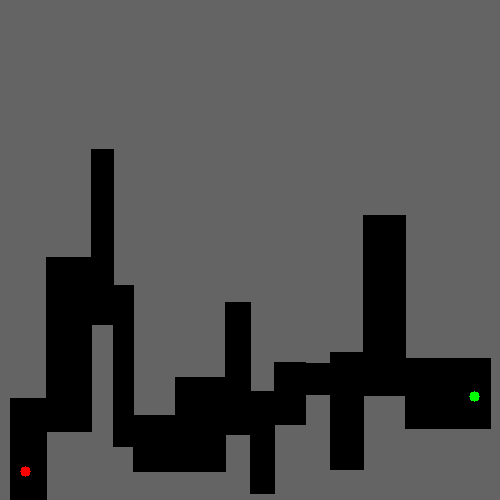

# Deep Q Learning for Maze Environments

Implementation of a various tools from **reinforcement learning** to solve an infinite number of **maze** environments.





### Prerequisites

The project relies on these libraries:

```
numpy
cv2
matplotlib
torch
```

## Implementation Ideas

### Remarks

* The probability of success is **highly variant**: the algorithm should come up with a **robust** method.
* The problem is **hard**, our aim is to find an algorithm that works robustly for simple cases *(i.e environments that do
not require lots of exploration)*

### Concept

Each episode has two phases:

1. ***Initialisation***: we follow the **greedy policy** for a given number of steps. 

2.  ***Exploration***: **ε-greedy policy** with decreasing ε from 1 to threshold.
The length of episodes and initialisation increase when the agent doesn’t visit a wall during the first phase.

### Intuition
The agent learns the map **step-by-step**. The more experience it has, the more it trusts itself with the greedy policy. Since there are always the same number of **exploration steps**, the agent keeps exploring ever farther zones as initialisation phase increases.

## Visualisation Tools

In order to assess each version of the algorithm, we developed a few visualisations:

### Neural Net Predicted Action Heat Map 


The figure shows an heatmap deep q learning prediction of **best action** for discretised states.  This shows that 3 hidden layers learning architecture enable the network more complex **action region separation.** 


###  Final Distance per episode


The figure shows the **final distance** at the end of each episode. It enable to see how close to the goal phase 2 ends and helps make sure the agent discover ever farther states.


###  Initialisation Steps per episode


The figure shows the number of Initialisation Steps per episode.
It illustrates how much the agent trust himself.

###  Final Greedy Agent


How the agent performed when only evaluated on **greedy policy**


## Acknowledgments

* I did not design the environments, the credit goes to **Dr Edward Jones**

